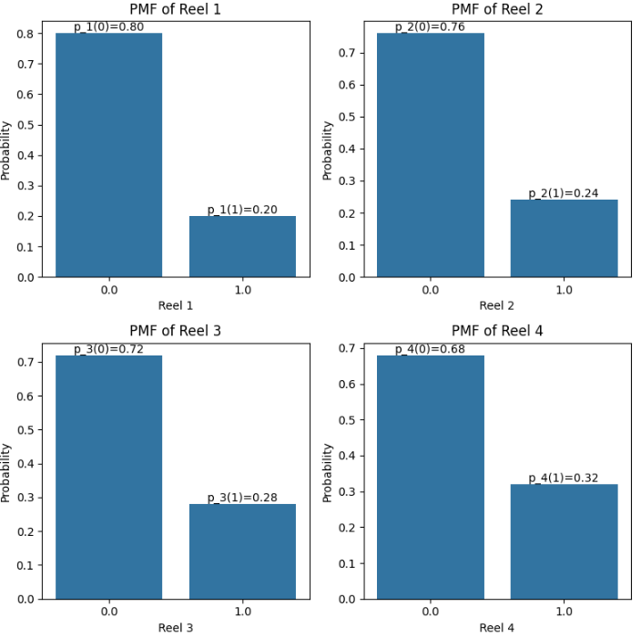
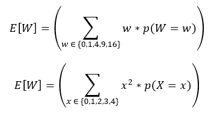
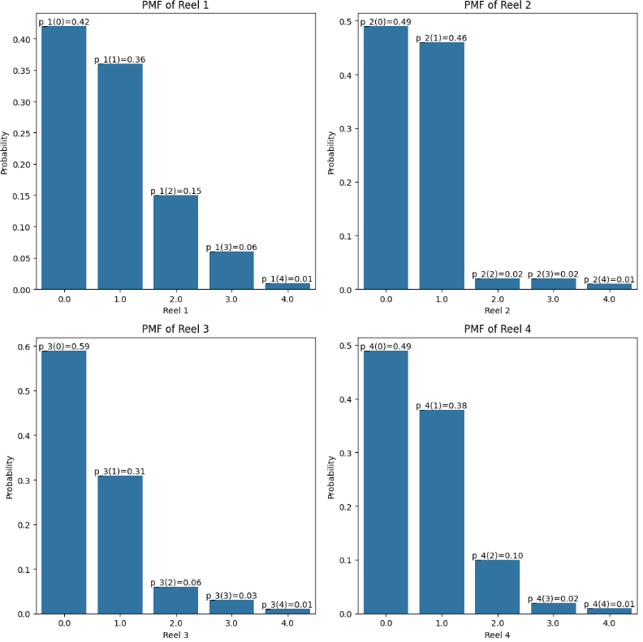
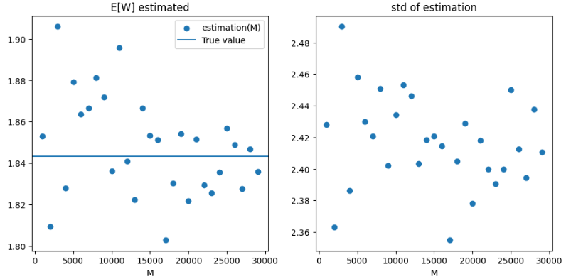
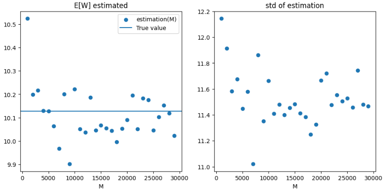

# Math-Task

Here is the main code: 🏹
[Notebook](https://github.com/Jankoetf/Math-Task/blob/main/BeeCool_Math_Assignment.ipynb)
🏹

Task text: 📜📃
[Assigment](https://github.com/Jankoetf/Math-Task/blob/main/MathAssignment.pdf)
📜📃

    

# ** Results for the Q1 **

so probabilities are p1 = 0.2, p2 = 0.24, p3 = 0.28, p4 = 0.32

formula for the **Q1**:

### result: **E[W] = 1.8432**

   

#  ** Results for the Q2 **

### result: **E[w] = 10.128**

  

# Results for the **Q3**

  

# Results for the **Q4**

**RS_01** : W_max = 16 witn probability: P(W_max) = 0.0043008

**RS_02** : W_max = 256 witn probability: P(W_max) = 0.00000001 = 1e-8

  

Thank you for this interesting task!

Here is the Google colab notebook: [Notebook](https://github.com/Jankoetf/Math-Task/blob/main/BeeCool_Math_Assignment.ipynb)

If you'd like to learn more about my background and qualifications, please visit my [LinkedIn profile](https://www.linkedin.com/in/jankomitrovic)

